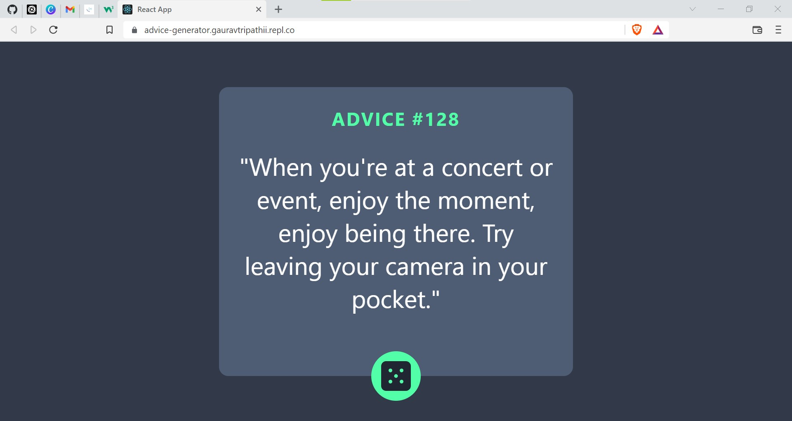

# Frontend Mentor - Advice generator app solution

This is a solution to the [Advice generator app challenge on Frontend Mentor](https://www.frontendmentor.io/challenges/advice-generator-app-QdUG-13db). Frontend Mentor challenges help you improve your coding skills by building realistic projects.

## Table of contents

- [Overview](#overview)
  - [The challenge](#the-challenge)
  - [Screenshot](#screenshot)
  - [Links](#links)
- [My process](#my-process)
  - [Built with](#built-with)
- [Author](#author)

## Overview

### The challenge

Users should be able to:
    Generate a random advice by clicking the dice button (at the bottom of the central card) or by refreshing the page.

- 

### Screenshot

### Links

- Solution URL: (https://github.com/Gauravtripathii/coolors)
- Live Site URL: (https://advice-generator.gauravtripathii.repl.co/)

## My process

### Built with

- [React](https://reactjs.org/) - JS library
- React API (for random advices)
- CSS

## Author

- Website - Gaurav (https://gauravtripathii.github.io/my-portfolio/)
- Frontend Mentor - (https://www.frontendmentor.io/profile/Gauravtripathii)